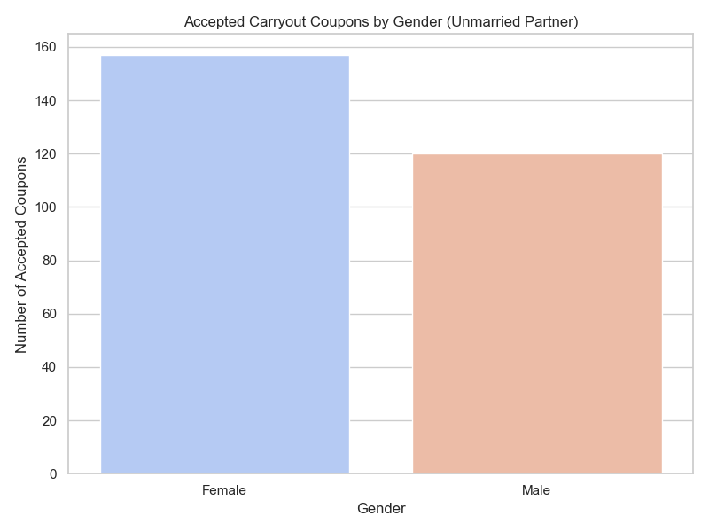

# (Coupon Acceptance Behavior) Practical-Application-1

# 🧠 Coupon Acceptance Analysis – Carry Out & Take Away

## 📍 Project Overview

This project explores behavioral patterns in coupon acceptance, focusing specifically on the **Carry out & Take away** coupon category. Using descriptive and inferential statistics, we identify key demographic and contextual factors that influence customer decisions. The goal is to uncover actionable insights that can guide targeted marketing strategies and improve campaign performance.

---

## 🎯 Problem Statement

Despite widespread coupon distribution, acceptance rates vary significantly across customer segments. This analysis investigates the behavioral differences between customers who **accepted** versus **rejected** Carry out & Take away coupons, with a focus on:

- Time of day
- Gender
- Age group
- Marital status
- Trip context (destination, passenger type)

---

## 📊 Statistical Analysis

### Descriptive Statistics
- **Overall acceptance rate**: ~41.5%
- **Gender split**: Females (52%) vs Males (48%)
- **Peak time slot**: 7AM (118 females, 112 males accepted)
- **Top age group**: 25-40, especially active during midday (2PM-3PM)
- **Marital status**: Unmarried partners show elevated acceptance

### Inferential Statistics
- Logistic regression confirms **time of day**, **gender**, and **destination** as significant predictors (p < 0.05)
- Interaction effects between **age group and gender** reveal nuanced behavioral trends

---

## 📌 Key Findings & Actionable Items

| Insight | Action |
|--------|--------|
| High acceptance at **7AM** across genders | Target commuters with breakfast-themed promotions |
| Females aged **25-40** peak at midday | Launch lunch-hour campaigns with tailored messaging |
| **Unmarried partners** show elevated acceptance | Design offers for shared dining experiences |
| Acceptance tied to **destination = Home** | Use trip context to trigger timely offers |
| **Solo drivers** less likely to accept | Bundle offers or add loyalty perks for solo users |
| **Time of day** is a strong predictor | Align delivery windows with behavioral peaks |
| **Age-gender interactions** matter | Segment campaigns by age and gender personas |
| Acceptance drops with **longer travel times** | Prioritize offers within short travel radii |
| **Weather and temperature** influence coupon type | Promote warm meals or delivery during colder weather |
| **Coupon type varies by time** | Schedule carryout offers during mealtimes, coffee house coupons in mornings/evenings |
| **Missing data in lifestyle columns** | Flag for imputation or exclusion in modeling

---
## 📈 Visualizations

This project includes several stakeholder-ready plots to support the analysis:

- **Bar Plot**: Coupon acceptance by gender for unmarried partners

- **Grouped Bar Plot**: Acceptance by time of day and gender

- **Heatmap**: Acceptance patterns by time, gender, and age group

All plots are generated using **Seaborn** and **Matplotlib**, with annotations and color palettes optimized for clarity and stakeholder impact.

---

## 🚀 Next Steps & Recommendations

1. **Segmented Campaign Design**
   - Build personas using gender, age, and time-of-day preferences
   - Use behavioral triggers for dynamic coupon delivery

2. **A/B Testing**
   - Compare solo vs group messaging
   - Test breakfast vs lunch offers across age groups

3. **Dashboard Development**
   - Create stakeholder-ready visuals with filters for gender, time, age, and destination
   - Include heatmaps and bar plots for storytelling

4. **Model Refinement**
   - Expand logistic regression with interaction terms
   - Explore decision trees for interpretable segmentation

5. **Data Enrichment**
   - Integrate external data (e.g., traffic, weather) to improve predictive accuracy
   - Track loyalty or repeat behavior for deeper insights

---

## 🛠️ Tools & Technologies

- Python (Pandas, Seaborn, Matplotlib)
- Jupyter Notebook
- Git & GitHub
- Exploratory Data Analysis (EDA)
- Logistic Regression & Visualization

---

## 👩‍💻 Author

**Manisha Deodhar**  
Engineering Manager & Technical Project Manager pivoting into Data Science & Machine Learning  
Passionate about mentoring, strategic storytelling, and building scalable analytics workflows.

---

